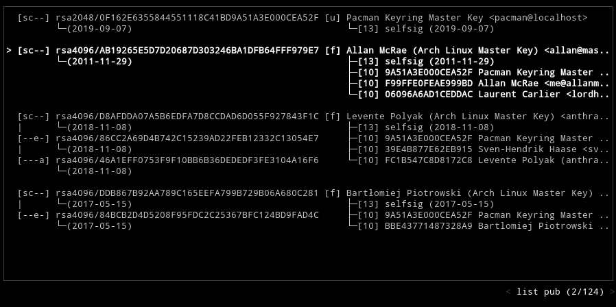
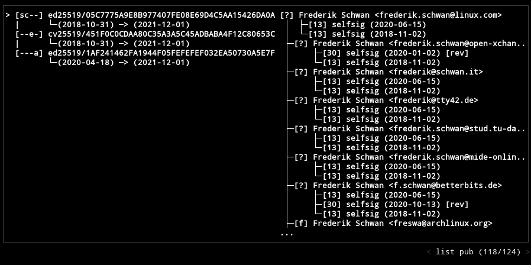
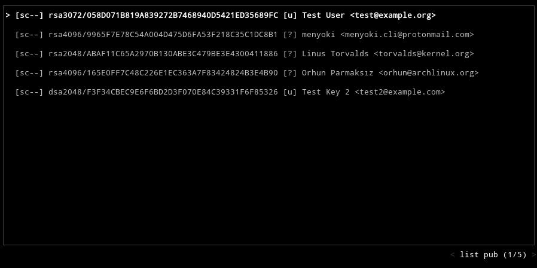
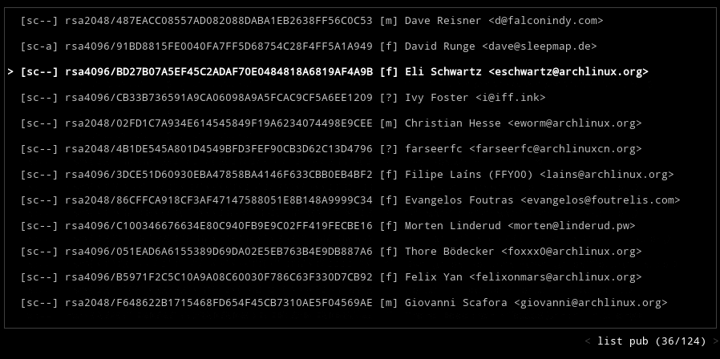
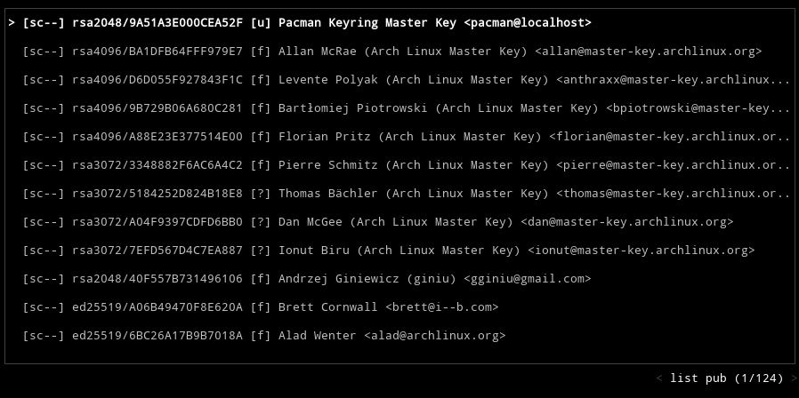
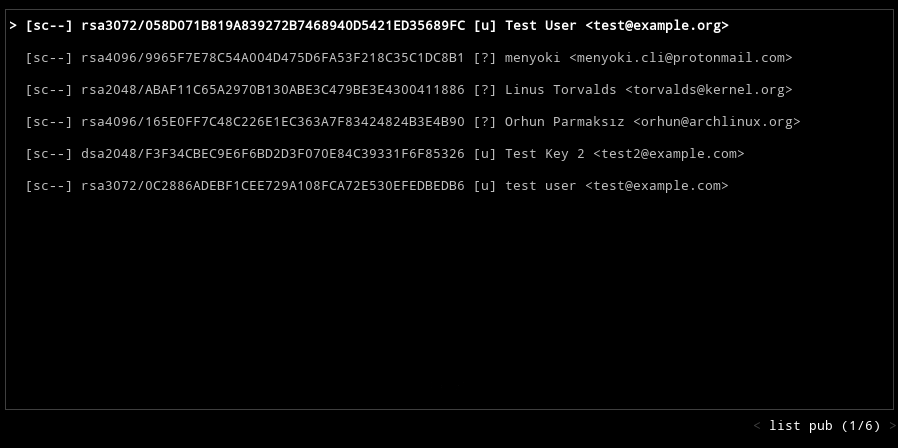
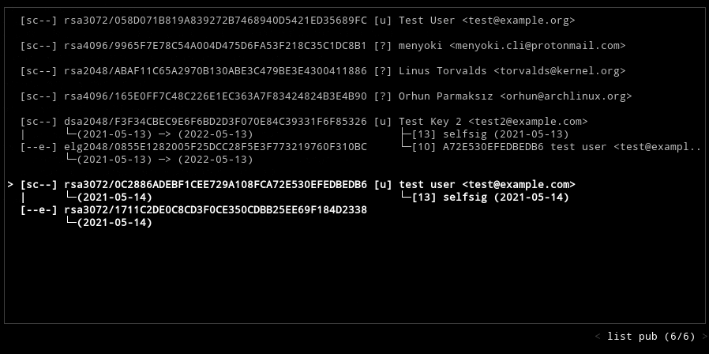
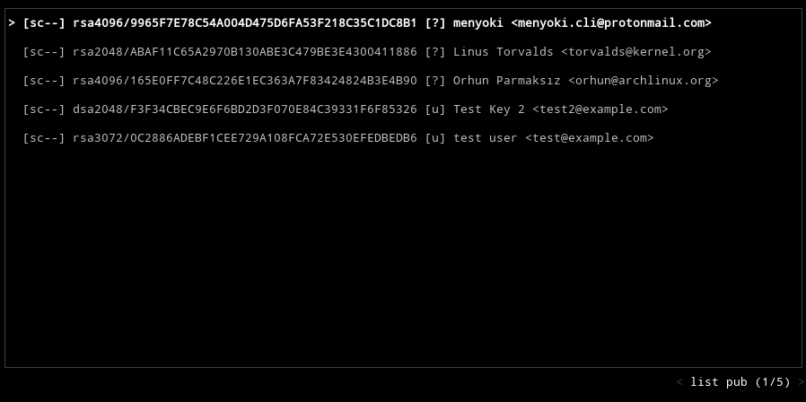
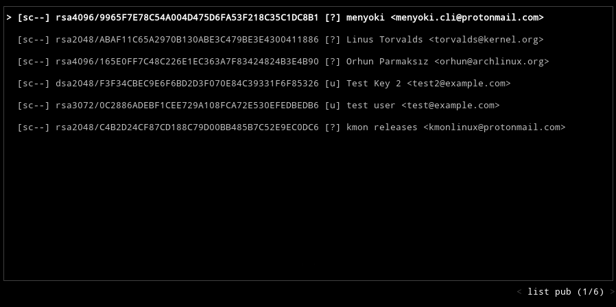
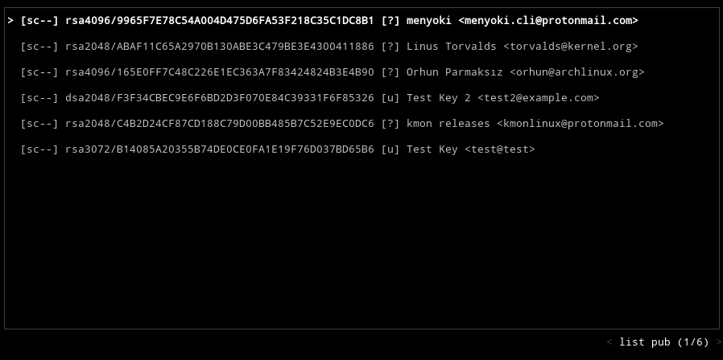

[](https://github.com/orhun/gpg-tui)

[](https://github.com/orhun/gpg-tui/releases)
[](https://crates.io/crates/gpg-tui/)
[](https://codecov.io/gh/orhun/gpg-tui)
[](https://github.com/orhun/gpg-tui/actions?query=workflow%3A%22Continuous+Integration%22)
[](https://github.com/orhun/gpg-tui/actions?query=workflow%3A%22Continuous+Deployment%22)
[](https://hub.docker.com/r/orhunp/gpg-tui)
[](https://docs.rs/gpg-tui/)

## About

**gpg-tui** is a [Terminal User Interface](https://en.wikipedia.org/wiki/Text-based_user_interface) for [GnuPG](https://gnupg.org/).

It aims to ease the key management operations such as listing/exporting/signing by providing an interface along with the command-line fallback for more complex operations. It is not trying to be a full-fledged interface for _all_ the features that [gpg](https://linux.die.net/man/1/gpg) provides but it tries to bring a more interactive approach to key management.

<details>
  <summary><b>Demo</b></summary>


<pre>
<b>gpg-tui</b> --style <span style="color: #036A9BFF"><i>colored</i></span> --splash --homedir <span style="color: #036A9BFF"><i>/etc/pacman.d/gnupg</i></span>
</pre>

</details>

<details>
  <summary>Table of Contents</summary>

- [About](#about)
- [Requirements](#requirements)
- [Installation](#installation)
  - [Cargo](#cargo)
  - [Arch Linux](#arch-linux)
  - [Docker](#docker)
    - [Docker Hub](#docker-hub)
    - [Using the Dockerfile](#using-the-dockerfile)
  - [Manually](#manually)
    - [Building from source](#building-from-source)
    - [Binary releases](#binary-releases)
- [Usage](#usage)
- [Key Bindings](#key-bindings)
  - [User Interface](#user-interface)
  - [Key Management](#key-management)
- [Approach](#approach)
  - [Detail Levels](#detail-levels)
  - [Key Information](#key-information)
  - [User Information](#user-information)
- [Features](#features)
  - [User Interface](#user-interface-1)
    - [Scrolling](#scrolling)
    - [Options Menu](#options-menu)
    - [Copy / Paste](#copy--paste)
    - [Detailed View](#detailed-view)
    - [Search](#search)
    - [Running commands](#running-commands)
  - [Key Management](#key-management-1)
    - [List](#list)
    - [Export](#export)
    - [Sign](#sign)
    - [Edit](#edit)
    - [Import/Receive](#importreceive)
    - [Send](#send)
    - [Generate](#generate)
    - [Delete](#delete)
    - [Refresh](#refresh)
  - [Styling](#styling)
    - [Colors](#colors)
    - [Splash screen](#splash-screen)
- [Roadmap](#roadmap)
  - [Platforms](#platforms)
  - [Packaging](#packaging)
  - [Command-Line Fallback](#command-line-fallback)
  - [Key Management Only](#key-management-only)
- [Resources](#resources)
  - [About the project](#about-the-project)
  - [External Links](#external-links)
- [Social Media](#social-media)
- [Funding](#funding)
- [License](#license)
- [Copyright](#copyright)

</details>

## Requirements

- Rust: `>=1.46.0`
- Core dependencies: `gnupg`, `gpgme>=1.7.0`, `libgpg-error`
- Other dependencies: `libxcb`

## Installation

### Cargo

**gpg-tui** is available on [crates.io](https://crates.io/crates/gpg-tui/):

```sh
cargo install gpg-tui
```

### Arch Linux

**gpg-tui** can be installed using available [AUR packages](https://aur.archlinux.org/packages/?O=0&SeB=b&K=gpg-tui&outdated=&SB=n&SO=a&PP=50&do_Search=Go) with an [AUR helper](https://wiki.archlinux.org/index.php/AUR_helpers):

```
paru gpg-tui
```

Or if you prefer, you can clone the [AUR packages](https://aur.archlinux.org/packages/?O=0&SeB=b&K=gpg-tui&outdated=&SB=n&SO=a&PP=50&do_Search=Go) and compile them with [makepkg](https://wiki.archlinux.org/index.php/Makepkg):

```
git clone https://aur.archlinux.org/gpg-tui.git
cd gpg-tui/
makepkg -si
```

### Docker

#### Docker Hub

See available [tags](https://hub.docker.com/r/orhunp/gpg-tui/tags).

```sh
docker pull orhunp/gpg-tui:[tag]
```

#### Using the Dockerfile

```sh
# clone the repository
git clone https://github.com/orhun/gpg-tui.git && cd gpg-tui/

# build the image
docker build -t gpg-tui .

# run the container
docker run -it gpg-tui
```

### Manually

#### Building from source

```sh
# clone the repository
git clone https://github.com/orhun/gpg-tui.git && cd gpg-tui/

# build and install
cargo install --root "$HOME/.cargo" --path .
```

#### Binary releases

See available [releases](https://github.com/orhun/gpg-tui/releases) that are automated by [Continuous Deployment](.github/workflows/cd.yml) workflow.

## Usage

```
gpg-tui [FLAGS] [OPTIONS]
```

```
FLAGS:
    -a, --armor      Enables ASCII armored output
        --splash     Shows the splash screen on startup
    -h, --help       Prints help information
    -V, --version    Prints version information
```

```
OPTIONS:
        --homedir <dir>        Sets the GnuPG home directory [env: HOMEDIR=]
    -o, --outdir <dir>         Sets the output directory [env: OUTDIR=]
    -d, --default-key <key>    Sets the default key to sign with [env: DEFAULT_KEY=]
    -t, --tick-rate <ms>       Sets the tick rate of the terminal [env: TICK_RATE=]  [default: 250]
    -c, --color <color>        Sets the accent color of the terminal [env: COLOR=]  [default: gray]
    -s, --style <style>        Sets the style of the terminal [env: STYLE=]  [default: plain]
                               [possible values: plain, colored]
```

## Key Bindings

### User Interface

| Key Binding          | Action                       |
| -------------------- | ---------------------------- |
| `?`                  | show help                    |
| `o,space,enter`      | show options                 |
| `hjkl,arrows,pgkeys` | navigate                     |
| `n`                  | switch to normal mode        |
| `v`                  | switch to visual mode        |
| `c`                  | switch to copy mode          |
| `p,C-v`              | paste from clipboard         |
| `a`                  | toggle armored output        |
| `1,2,3`              | set detail level             |
| `t,tab`              | toggle detail (all/selected) |
| `` ` ``              | toggle table margin          |
| `m`                  | toggle table size            |
| `C-s`                | toggle style                 |
| `/`                  | search                       |
| `:`                  | run command                  |
| `r,f5`               | refresh application          |
| `q,C-c/d,escape`     | quit application             |

### Key Management

| Key Binding   | Action        |
| ------------- | ------------- |
| `x`           | export key    |
| `s`           | sign key      |
| `e`           | edit key      |
| `i`           | import key(s) |
| `f`           | receive key   |
| `u`           | send key      |
| `g`           | generate key  |
| `d,backspace` | delete key    |
| `C-r`         | refresh keys  |

## Approach

Available keys in the keyring (which can be specified via `--homedir` argument) are showed on a table. This table consists of 2 columns which are [key information](#key-information) and [user information](#user-information).

The level of detail that an individual table row shows is determined by [detail levels](#detail-levels).

### Detail Levels

1. **Minimum**: shows only the primary key and user ID.

```
[sc--] rsa3072/B14085A20355B74DE0CE0FA1E19F76D037BD65B6  │  [u] Example Key <example@key>
```

2. **Standard**: shows all the subkeys and user IDs.

```
[sc--] rsa3072/B14085A20355B74DE0CE0FA1E19F76D037BD65B6  │  [u] Example Key <example@key>
|      └─(2021-05-14)                                    │   └─[u] Other User ID <example@key>
[--e-] rsa3072/E56CAC142AE5A979BEECB00FB4F68595CAD4E7E5  │ 
       └─(2021-05-14)
```

3. **Full**: shows signatures.

```
[sc--] rsa3072/B14085A20355B74DE0CE0FA1E19F76D037BD65B6  │  [u] Example Key <example@key>
|      └─(2021-05-14)                                    │   │  └─[13] selfsig (2021-05-16)
[--e-] rsa3072/E56CAC142AE5A979BEECB00FB4F68595CAD4E7E5  │   └─[u] Other User ID <example@key>
       └─(2021-05-14)                                              ├─[13] selfsig (2021-05-16)
                                                                   └─[10] 84C39331F6F85326 Other Signer Key <example@signer> (2021-05-16)
```

### Key Information

An example table entry for the detail level `full` (which includes subkeys) is explained via reference numbers below.

<pre>
[sc--]<b>⁰</b> rsa3072<b>¹</b>/B14085A20355B74DE0CE0FA1E19F76D037BD65B6<b>²</b>
|<b>³</b>      └─(2021-05-14)<b>⁴</b>
[--e-]<b>⁰</b> rsa3072<b>¹</b>/E56CAC142AE5A979BEECB00FB4F68595CAD4E7E5<b>²</b>
        └─(2021-05-14) -> (2021-05-16)<b>⁴</b> [exp]<b>⁵</b>
</pre>

**0**: Key flags. Determines what this key can do.

* `s`: sign
* `c`: certify
* `e`: encrypt
* `a`: authenticate

**1**: Algorithm of the key.

**2**: Fingerprint of the key.

**3**: Indicates that the next key is a subkey.

**4**: Time information of the key:

* creation time (`Y-m-d`)
* expiration time (`Y-m-d`)

**5**: Is the key one of the following?

* `[exp]`: expired
* `[rev]`: revoked
* `[d]`: disabled
* `[i]`: invalid
* `[q]`: qualified

### User Information

An example table entry for the detail level `full` (which includes other user IDs and signatures) is explained via reference numbers below.

<pre>
[u]<b>⁰</b> Test Key &lt;test@test&gt;<b>¹</b>
 │<b>²</b>  └─[13]<b>³</b> selfsig<b>⁴</b> (2021-05-16)<b>⁶</b>
 └─[u]<b>⁰</b> Test Key2 &lt;test2@test2&gt;<b>¹</b>
        ├─[13]<b>³</b> selfsig<b>⁴</b> (2021-05-16)<b>⁶</b>
        └─[10]<b>³</b> 84C39331F6F85326 Test Key 2 &lt;test2@example.com&gt;<b>⁵</b> (2021-05-16)<b>⁶</b> [!x]<b>⁷</b>
</pre>

**0**: Validity of the user.

* `q`: undefined
* `n`: never
* `m`: marginal
* `f`: full
* `u`: ultimate
* `?`: unknown

**1**: User ID. (`name` + `email`)

**2**: Indicates the next user ID.

**3**: Certification level of the signature.

* `10`: no indication
* `11`: personal belief but no verification
* `12`: casual verification
* `13`: extensive verification

**4**: Indicates that this is a self signature, whereby the users' own private key was used to sign their public key.

**5**: Key and user ID of the signer. (`key` + `name` + `email`)

**6**: Time information of the signature.

* creation time (`Y-m-d`)
* expiration time (`Y-m-d`)

**7**: Is the signature one of the following?

* `[exp]`: expired
* `[rev]`: revoked
* `[i]`: invalid
* `[!x]`: non-exportable

## Features

Press `?` while running the terminal interface to see information about key bindings and GnuPG configuration.


### User Interface

#### Scrolling

Use arrow or `hjkl` keys to scroll and navigate through lists/menus/tabs. Additionally, you can use `Ctrl-Up/Down` combinations or `PageUp`/`PageDown` keys to scroll to the top/bottom.


If rows are not fitting on the terminal interface, use `Alt` + arrow/`hjkl` keys to individually scroll them.





#### Options Menu

Most of the actions can be performed using the options menu. Simply press `Enter` and select what you want to do.


#### Copy / Paste

There's a `copy` mode for making it easier to copy particular values to the clipboard. To use this mode, press `c` followed by one of the key bindings:

* `x`: Copy the exported key
* `i`: Copy the key id
* `f`: Copy the key fingerprint
* `u`: Copy the user id
* `1,2`: Copy the content of the row

Then the value will be copied to the clipboard and the application mode will be reverted to `normal`.

Press `ESC` or `n` to cancel and switch to `normal` mode during this operation.


Instead of copying values with `copy` mode, you can use the `visual` mode which disables the mouse capture. It means that you can select/highlight the text on the interface and copy as you do normally.

`visual` mode can be used for other purposes such as scrolling via mouse.


#### Detailed View

Press `Tab` to toggle the [detail level](#detail-levels) for the selected entry in the list. Number keys (e.g. `1`, `2`, `3`) can be also used to set a specific level.



Press `t` to toggle the detail level for all entries in the list.


There are couple a of different modes for the size of the tables which changes the details that each entry shows. You can use the `m` key for switching to different modes.



#### Search

Press `/` to search for a value from the currently shown table.



#### Running commands

Every operation on the terminal interface is handled implicitly by the application-specific commands. So it's possible to do certain things by switching to command mode with pressing `:` and running commands. (similar to Vim)

For example,

* `:list pub` -> list public keys
* `:set armor true` -> enable armored output

A full list of commands can be found [here.](COMMANDS.md)


Also you can switch between command mode and search by pressing `Tab`.


### Key Management

#### List

Available keys in the keyring are listed on a table as default. They can be [scrolled](#scrolling) or the listing type (public/secret keys) can be changed by changing the tab via arrow keys. 

See the [approach](#approach) section for more information about the meaning of the table rows.


#### Export

Press `x` to export the selected key to a file. The default output directory is `$GNUPGHOME/out` and can be changed by either using `--homedir` or `--outdir` argument.

Additionally, you can enable/disable armored output by pressing `a`.


#### Sign

Press `s` to sign the selected key with the default secret key. This key can be specified with `--default-key` argument.

This feature uses `gpg` fallback and runs `gpg --sign-key` command.



#### Edit

Press `e` to edit the selected key.

This feature uses `gpg` fallback and runs `gpg --edit-key` command. It presents a menu that provides a list of options to change the key details. See the [edit-key](https://www.gnupg.org/gph/en/manual/r899.html) documentation for more information.



#### Import/Receive

Import operation is done by using the `:import` command. So press `i` to switch to command mode (which will automatically add the import command) and then give it your file(s) to import.


Similar to import, receive operation is also done by using a command which is `:receive`. So press `f` (for **f**etching keys from a keyserver) and give it your key ID(s).

This feature uses `gpg` fallback and runs `gpg --receive-keys` command.



#### Send

Press `u` (for **u**ploading to the keyserver) followed by `y` (for confirmation) to send the selected key to the default keyserver.


#### Generate

Press `g` to generate a new key pair.

This feature uses `gpg` fallback and runs `gpg --full-generate-key` command. It presents dialogs for all of the generation options.


#### Delete

Press `Backspace` followed by `y` (for confirmation) to delete the selected key from the keyring.



#### Refresh

Press `Ctrl-y` for refreshing the keyring.

This feature uses `gpg` fallback and runs `gpg --refresh-keys` command. 



### Styling

You can customize the look of **gpg-tui** to get rid of its _boring_ and _minimalistic_ vibe. (!)

#### Colors

To enable colors, you can specify a style with `--style` argument or press `Ctrl-S` while running for toggling the style. Currently, only one style is supported which is `colored`.

```sh
gpg-tui --style colored
```


If the default _accent_ color of the interface causes problems with your theme or if you just want to change it to something more vivid, you can use `--color` argument to specify another color in HEX format.

```sh
gpg-tui --style colored --color 507030
```


#### Splash screen

There is a splash screen that shows the project's logo for a couple of seconds if `--splash` flag is present. It's purely cosmetical.

```sh
gpg-tui --splash
```


To enable colors for the splash screen, use the `colored` style.

```sh
gpg-tui --splash --style colored
```


## Roadmap

### Platforms

**gpg-tui** is tested on Linux systems during the development phase. It should be tested on other platforms such as Microsoft Windows and macOS and found issues should be reported for future compatibility with these platforms.

### Packaging

[](https://repology.org/project/gpg-tui/versions)

**gpg-tui** should be more and easily accessible for other platforms/distributions. Thus, it should be packaged for package managers such as [Homebrew](https://brew.sh/) and [APT](https://en.wikipedia.org/wiki/APT_(software)). If you're a packager and want to contribute, feel free to [submit an issue](https://github.com/orhun/gpg-tui/issues/new/choose) or [start a discussion](https://github.com/orhun/gpg-tui/discussions/new)!

### Command-Line Fallback

Some of the features of **gpg-tui** require the execution of the CLI program `gpg` in order to operate. This is due to the fact that designing a TUI for the menus that gpg already provides is redundant and time-consuming. Also, in case these menus will change in the future, it is better to rely on the gpg rather than implementing these options using GPGME. On the other hand, gpg has some commands that GPGME doesn't directly provide. (e.g `--refresh-keys`) So it is more convenient to utilize gpg for these cases.

The plan for the future of **gpg-tui** is utilizing `gpg` _when it is necessary_, depending on whether if it is more convenient for the user.

### Key Management Only

**gpg-tui** only aims to do **key management** for now, although it can do much more utilizing GPGME and/or `gpg`. It's due to the design choice and also for setting the boundaries of the project.

## Resources

### About the project

* [Code of Conduct](./CODE_OF_CONDUCT.md)
* [Contribution Guidelines](./CONTRIBUTING.md)
* [Changelog](./CHANGELOG.md)
* [List of Commands](./COMMANDS.md)

### External Links

* [GnuPG Documentation](https://gnupg.org/documentation/)
* [Understanding PGP/GPG Key Server Output](https://www.jamieweb.net/blog/understanding-pgp-gpg-key-server-output/)
* [What is the meaning of GnuPG's --list-sigs output?](https://security.stackexchange.com/questions/141501/what-is-the-meaning-of-gnupgs-list-sigs-output)

## Social Media

* [](https://twitter.com/gpg_tui)
* [](https://orhun.dev)
  * [](https://github.com/orhun)
  * [](https://twitter.com/orhunp_)

## Funding

If you find **gpg-tui** and/or other projects on my [GitHub profile](https://github.com/orhun/) useful, consider [becoming a patron](https://www.patreon.com/join/orhunp)!

[](https://patreon.com/join/orhunp)
[](https://patreon.com/join/orhunp)

## License

[The MIT License](https://opensource.org/licenses/MIT)

## Copyright

Copyright © 2021, [Orhun Parmaksız](mailto:orhunparmaksiz@gmail.com)
